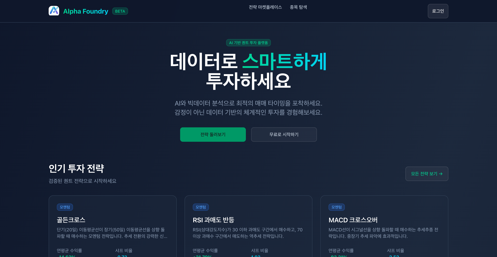
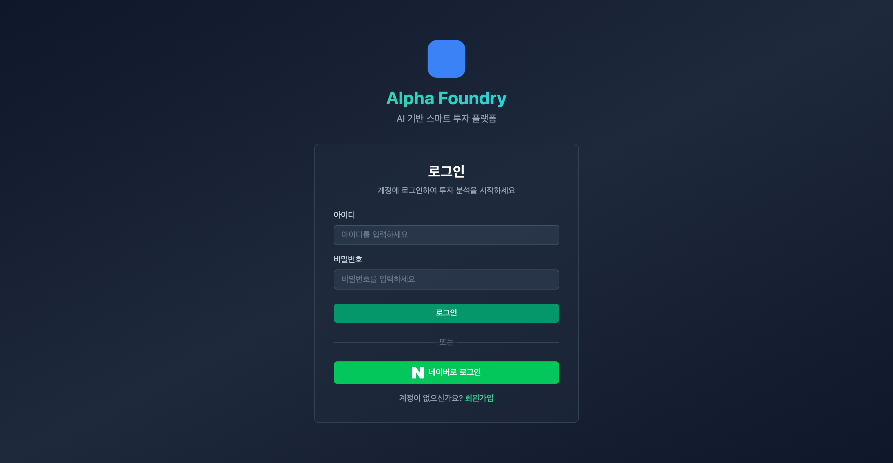
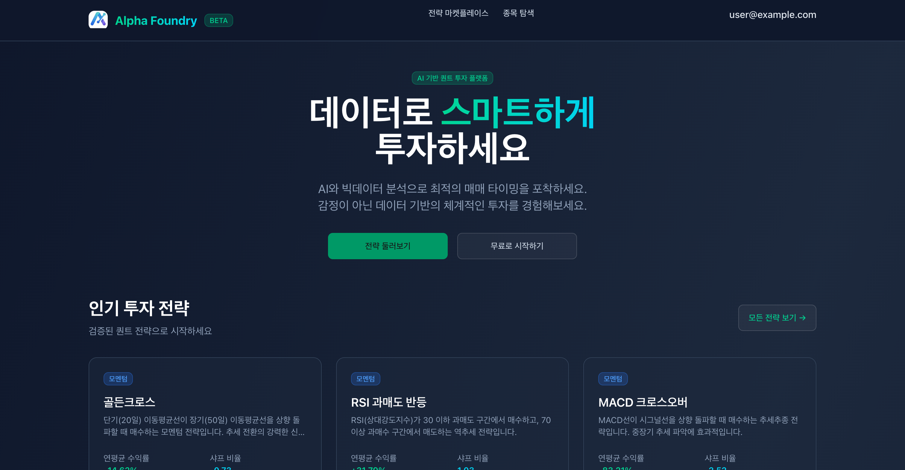

# 네이버 로그인 이용 절차

## 1단계: 로그인 버튼 클릭
사용자가 Alpha Foundry 홈페이지 우측 상단의 "로그인" 버튼을 클릭합니다.
- 위치: 헤더 우측 상단
- 버튼 텍스트: "로그인"

---

## 2단계: 로그인 화면
사용자는 다음 두 가지 방법으로 로그인할 수 있습니다:
- **일반 로그인**: 아이디/비밀번호 입력
- **네이버 로그인**: "네이버로 로그인" 버튼 클릭

네이버 로그인을 선택하면, 네이버 OAuth 화면으로 이동하여 다음 정보 제공에 동의를 요청합니다:
- **필수 제공 정보**: 이메일 주소

---

## 3단계: 로그인 완료
로그인이 완료되면 사용자는 Alpha Foundry 메인 페이지로 리다이렉션됩니다.
- 헤더에 사용자 이메일 주소가 표시됩니다
- "로그인" 버튼이 "로그아웃" 버튼으로 변경됩니다

---

## 이메일 주소 활용처

이메일 주소는 다음과 같이 사용됩니다:
1. **사용자 식별**: 회원 계정 식별자로 사용
2. **서비스 알림**: 중요 공지사항 및 서비스 업데이트 발송
3. **고객 지원**: 문의 응답 및 계정 관련 안내

이메일은 서비스 내 어디에서도 공개되지 않으며, 오직 계정 관리 목적으로만 사용됩니다.

---

## 개인정보 보호

- 수집된 이메일 주소는 암호화되어 안전하게 저장됩니다
- 제3자에게 제공되지 않습니다 (법적 요구사항 제외)
- 회원 탈퇴 시 즉시 삭제됩니다

자세한 내용은 [개인정보처리방침](https://alphafoundry.co.kr/privacy)을 참조하세요.
